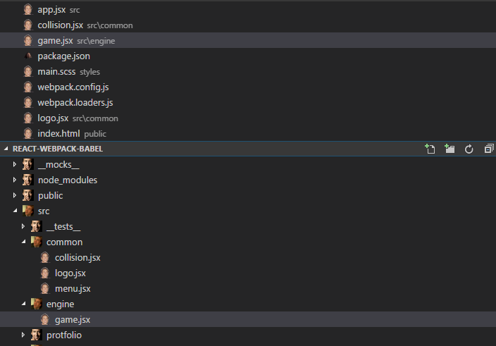

# Cage Icons

## Installation

To install the extension just execute the following command:

```sh
ext install cage-icons
```

## Usage
* `Linux` & `Windows` > **File > Preferences > File Icon Theme > Cage Icons**.
* `MacOS` > **Code > Preferences > File Icon Theme > Cage Icons**.

## Example



## More Info

[IMDb](http://www.imdb.com/name/nm0000115/)

[Wikipedia](https://en.wikipedia.org/wiki/Nicolas_Cage)
